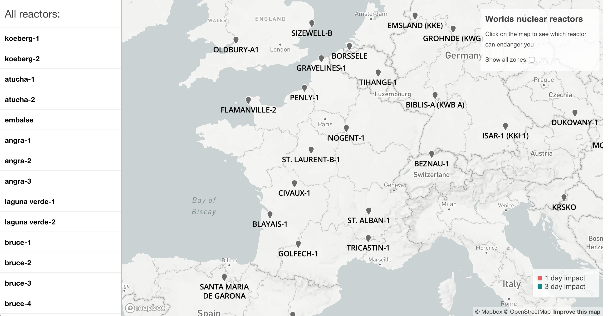

# Overview
This applocation shows nuclear power plants in the world on the map. Most important features are: 
- Clickable markers on the mat for more information about the plant. After clicking on the reactor two types of zones are displayed. Red is a one day impact after reactor explosion. Green one is an impact within 3 days after explosion.
- Search closest reactors by clicking somewhere on the map. Ordering by proximity to chosen location.
- Showing safe zones on the map.
- Everything is assynchronous. 

This is it in action:



The application has 2 separate parts, the client which is a [frontend web application](#frontend) using mapbox API and mapbox.js and the [backend application](#backend) written in [Django](https://www.djangoproject.com/). Database is in PostGIS. The frontend application communicates with backend using a [REST API](#api).

# Frontend

The frontend application is a static HTML page (`/project/app/gis_app/geo_backend/templates/default.html`), which shows a mapbox.js widget with a sidebar at the left side. It is displaying nuclear reactors in the whole world. I use polygon layer in mapbox.gl to display all the danger zones after clicking on the reactor. 

All relevant frontend code is in the same html file. The frontend code responsibilities are:
- detecting coursor location, using the standard [mapbox tool](https://www.mapbox.com/mapbox-gl-js/example/mouse-position/)
- displaying the sidebar panel with reactor  list driving the user interaction.
- displaying geo features by overlaying the map with a geojson layer, the geojson is provided directly by backend API.
- I also used [mapbox popups](https://www.mapbox.com/mapbox-gl-js/example/popup-on-click/) to give better overwiev for chosen reactor.

# Backend

The backend application is written in Django framework and is responsible for querying geo data, formatting the geojson and data for the sidebar panel.

## Data
As data source I used [list of nuclear reactors for year 2017](https://datashare.is.ed.ac.uk/handle/10283/2464?show=full). I imported the shape file of mentioned list directly as a Django model to postgis database. As a tool I used django's [LayerMapping function](https://docs.djangoproject.com/en/2.1/ref/contrib/gis/tutorial/), which converts the shp file to conventional django model. You can find `Powerplant` table specification in `/project/app/gis_app/geo_backend/models.py`. I generate geojson for mapbox layers directly in postgrs query by using a standard `st_asgeojson` function, however some postprocessing is necessary. You  can find all the queries in `/project/app/gis_app/geo_backend/views.py`.

## Deployment
The whole project is organised into two [Docker](https://www.docker.com/) containers. First one `db` is used for postgis database and the second one `backend` is for django server. All necessary python librarries are listed in `project/app/requirements/development.pip`. To run all services just run `docker-compose up` from `/project` directory.

To import data dowload the [source data](https://datashare.is.ed.ac.uk/handle/10283/2464?show=full). Locate the `.shp` file into `/project/app/gis_app/geo_backend/data/NuclearReactors2011.shp`. Make sure containers are running (`docker-compose up` from `/project`) go to django console by runnig:

```
$ docker-compose run backend shell
```

And execute prepared script:

```
>>> from geo_backend import load
>>> load.run()
>>> quit() # to leave the console
```

## Api

**Find polygons for chosen nuclear reactor**

`GET /polygon?lat=25346&long=46346123`

**Find nearest reactors for chosen location**

`GET /surroundings?lat=25346&long=46346123`

**Find all danger zones**

`GET /all_plants`

### Response
Api calls returns direct geojson data. Depending on scenario data is being displayed directly to the map or some post processing is made to prepare html for the sidebar at the client side. 